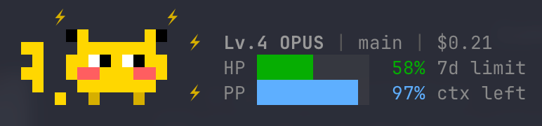

# pikabar

A Pokemon-style statusline for [Claude Code](https://docs.anthropic.com/en/docs/claude-code).

Turn your rate limits into a Pokemon battle HUD. Pikachu reacts to your coding session in real-time — thinking with lightning bolts, celebrating commits, and fainting into a Pokeball when you're rate limited.

<p align="center">
  
</p>

## Features

- **Pikachu pixel art** rendered with Unicode half-blocks (▀▄█) + ANSI 256-color
- **8 reaction states**: idle, thinking, staging, committed, recovered, compacted, hit, faint
- **HP bar** = rate limit quota remaining (green > yellow > red, like the games)
- **PP bar** = context window space remaining (steel blue)
- **Status badges**: `[PAR]` `[SLP]` `[PSN]` `[BRN]` `[FRZ]` with game-accurate colors
- **Lv.N SPECIES** model display (Lv.4 OPUS, Lv.3 SONNET)
- **Session cost** tracking ($0.42)
- **Delta-driven reactions** — Pikachu responds to changes between statusline calls
- **Pokeball** when rate limited (Pikachu recalled!)
- **64 flavor texts** + easter eggs in Pokemon battle narrator voice
- **Git branch** + staged/modified counts
- **Zero dependencies** — pure Python 3.8+ stdlib

## Quick Start

```bash
pip install git+https://github.com/fioenix/claude-pikabar.git
pikabar install
```

That's it. Restart Claude Code and Pikachu appears.

To remove: `pikabar uninstall`

### Manual install (without pip)

<details>
<summary>Click to expand</summary>

```bash
git clone https://github.com/fioenix/claude-pikabar.git ~/.claude/pikabar
```

Add to `~/.claude/settings.json`:

```json
{
  "statusLine": {
    "type": "command",
    "command": "python3 ~/.claude/pikabar/pikabar/statusline.py",
    "padding": 1
  }
}
```

</details>

## Demo Mode

Preview all reaction states:

```bash
cd ~/.claude/pikabar
python3 demo.py
```

## How It Works

Claude Code pipes JSON session data to the statusline script via stdin on each interaction. pikabar reads the JSON, computes deltas from the previous call, infers the appropriate reaction, renders the sprite + info panel, and prints multi-line ANSI output to stdout.

### Data Flow

```
Claude Code ──JSON stdin──▶ statusline.py ──stdout──▶ Terminal
                               │
                               ├── Load previous state (/tmp/pikabar-state-*)
                               ├── Compute deltas (HP, context, cost, git)
                               ├── Infer events → pick reaction
                               ├── Render sprite + HP/PP bars + badges
                               ├── Save current state (atomic write)
                               └── Output 5-line ANSI art
```

### HP Bar Semantics

HP represents your **rate limit quota remaining**:

| HP | Color | Meaning |
|---|---|---|
| >50% | Green | Plenty of quota left |
| 20-50% | Yellow | Burning through moves |
| 5-20% | Red | Danger zone |
| <5% | Flashing red | About to faint |
| 0% | Pokeball appears | Rate limited (paralyzed!) |

HP uses whichever rate window (5-hour or 7-day) is more constrained.

### PP Bar Semantics

PP represents your **context window space remaining**:

| PP | Color | Meaning |
|---|---|---|
| High | Steel blue | Plenty of context space |
| Low | Steel blue | Context filling up |
| Compacted | SLP badge | Context was compacted |

### Reaction System

pikabar detects changes between statusline calls and picks the highest-priority reaction:

| Reaction | Trigger | Visual |
|---|---|---|
| faint | HP < 15% | Pokeball sprite |
| hit | Heavy cost/HP burst | Sweat drops |
| compacted | Context window compacted | ZZZ + SLP badge |
| thinking | Long operation (>8s) | Lightning bolts ⚡ |
| recovered | HP jumped back up | Sparkles ✦ |
| committed | Git staged count dropped | Hearts ♥ |
| staging | Files modified/staged | Stars * |
| idle | Default | Normal Pikachu |

### Status Badges

One badge at a time, Pokemon game-accurate priority:

| Badge | Trigger | Color |
|---|---|---|
| `FRZ` | HP=0 + compacting | Ice blue |
| `PAR` | Rate limited | Gold |
| `SLP` | Compacting context | Gray |
| `PSN` | HP <= 15% | Purple |
| `BRN` | HP <= 35% | Orange |

## Project Structure

```
pikabar/
├── demo.py                  # Interactive demo (python3 demo.py)
├── pyproject.toml           # Package config (pip install -e .)
├── pikabar/
│   ├── __init__.py          # Version + exports
│   ├── palette.py           # ANSI 256-color constants + terminal escapes
│   ├── renderer.py          # Half-block pixel art engine (▀▄█)
│   ├── sprites.py           # Pikachu (8 states) + Pokeball pixel grids
│   ├── hp_bar.py            # HP/PP bar rendering + status badges
│   ├── info_panel.py        # 5-line layout engine with 8 decorators
│   ├── delta.py             # State persistence + delta detection + reactions
│   ├── flavor.py            # 64 flavor texts + easter eggs
│   ├── animator.py          # Demo-only animation engine
│   └── statusline.py        # Entry point (stdin JSON → stdout ANSI)
├── tests/                   # pytest test suite
└── LICENSE                  # MIT
```

## Requirements

- Python 3.8+
- A 256-color terminal (iTerm2, Kitty, WezTerm, Alacritty, Windows Terminal)
- [Claude Code](https://docs.anthropic.com/en/docs/claude-code) for the statusline integration
- No external Python dependencies

## Performance

- Script runs on each Claude Code interaction (~300ms debounce)
- Git operations cached for 5 seconds
- State persisted in `/tmp/pikabar-state-*` (per-workspace, atomic writes)
- No network calls, no API tokens consumed

## Testing

```bash
pip install pytest
pytest
```

## License

MIT

## Credits

Built for the [Claude Code statusline API](https://docs.anthropic.com/en/docs/claude-code). Inspired by every Pokemon game ever made.
